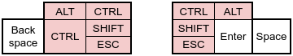
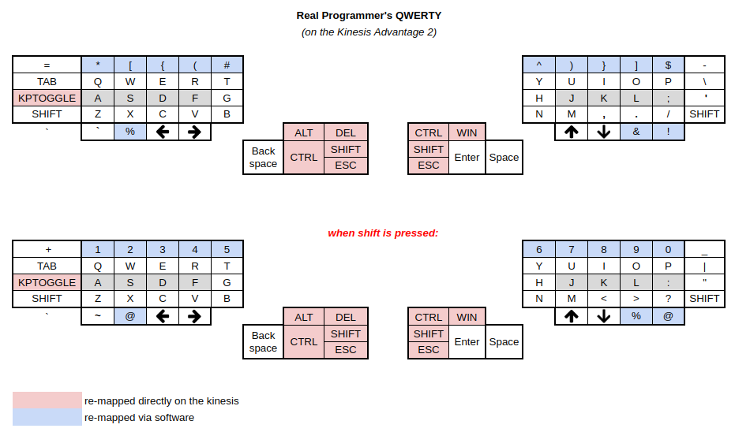
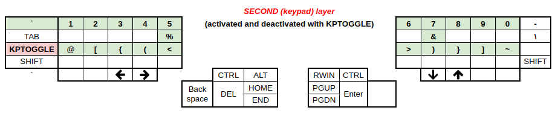
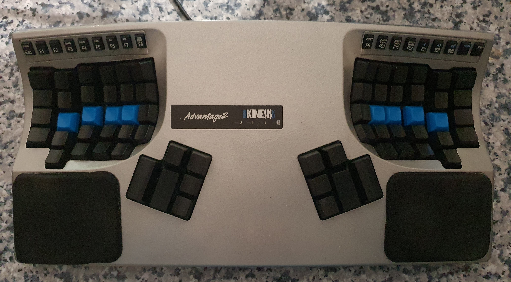

# Real Programmer's QWERTY

If you're in a hurry, [see what it looks like](#what-it-looks-like) or go straight to [installing it](#installing-it).

# Motivation

Inspired by ThePrimeagen's [Real Programmers Dvorak](https://github.com/ThePrimeagen/keyboards), I realized my QWERTY layout needs an update.

But let the harpoon man speak for himself:

> I type everyday of the week. For five of those seven days, i type for about 6-7 hours. It makes sense, removing my will for complacency, that i switch to a more efficient keyboard, if there is one. I present to you, Real Programmers Dvorak.

While I wouldn't go full dvorak myself, the rest of it makes perfect sense, especially after switching to a [Kinesis Advantage 2](https://kinesis-ergo.com/keyboards/advantage2-keyboard/) keyboard, where it's all about comfy programming now :-)!

## On German keyboard layouts and programming

But let's take a step back for now. While German is my mother tongue, I never really got the hang of German keyboard layouts. Growing up with a Commodore 128 home computer, I later never liked having to trade brackets and braces for Umlauts that I would only ever use when writing German prose. So for the most time, I stuck with a US keyboard layout, as I considered it far superior for programming. Having to press the alternate graphics (AltGr), shift, AND a number key for braces - who in their right mind would come up with this? On top of that, switching between DE and US keyboard layouts is pretty easy on modern computers - should the odd case come up that I need the Umlauts.

So clearly, the US keyboard layout had been an improvement already. But it took switching to the Advantage 2 keyboard, where the square brackets are located more inconveniently for my taste, to re-evaluate my options. As mentioned above, inspired by the real programmer's DVORAK layout, I started to think about how to optimize my QWERTY for programming.

## The idea of going full-programmer (keyboard layout)

In short:

1. Symmetrical symbol layout (parens, brackets, curlies)
2. Removing the need for SHIFT by putting numerical digits on the SHIFT row instead

The main idea for me was a good symbol layout with a symmetrical layout of opening and closing braces, brackets, and parentheses. That means, the finger used to close is the same finger on the other hand, like: left index finger for opening parens, right index finger for closing parens.

The second idea was having those symbols accessible without having to press the SHIFT key. Intuitively it made sense immediately that I type numbers far less frequently than I type those brackets, parens, and curly braces. Pressing SHIFT+1 instead of 1 is really not a big deal.

## Implementing it

Since parens are already present on the number row, only four symbols have to be replaced to make space for brackets and curly braces. Regarding placement, all of the opening and closing symbols must be easily accessible for me. On my keyboard that means using the 2, 3, 4 and 7, 8, 9 keys which are reachable easily by extending my ring, middle, and index fingers.

So this boils down to the following mapping:

- 2 -> `[`
- 3 -> `{`
- 4 -> `(`
- 7 -> `)`
- 8 -> `}`
- 9 -> `]`

Eventually, I decided on which symbols to move off the number row:

- @ - goes right below the redundand key below the X (`\` / `|`) + SHIFT
- % - also goes below that redundand key, un-shifted
- & - goes where [ was
- ! - goes where ] was

This results in the following re-mapping of the top-row:

LEFT:

- <kbd>=</kbd> -> <kbd>=</kbd>
- <kbd>1</kbd> -> <kbd>*</kbd>
- <kbd>2</kbd> -> <kbd>[</kbd>
- <kbd>3</kbd> -> <kbd>{</kbd>
- <kbd>4</kbd> -> <kbd>(</kbd>
- <kbd>5</kbd> -> <kbd>#</kbd>

RIGHT:

- <kbd>6</kbd> -> <kbd>^</kbd>
- <kbd>7</kbd> -> <kbd>)</kbd>
- <kbd>8</kbd> -> <kbd>}</kbd>
- <kbd>9</kbd> -> <kbd>]</kbd>
- <kbd>0</kbd> -> <kbd>$</kbd>
- <kbd>-</kbd> -> <kbd>-</kbd>

Extra mappings:

- <kbd>\\</kbd> (below the X) -> <kbd>%</kbd>
- <kbd>|</kbd> (below the X) -> <kbd>@</kbd>
- <kbd>[</kbd> -> <kbd>&</kbd>
- <kbd>]</kbd> -> <kbd>!</kbd>

The numerical digits 0-9 are accessible by pressing the SHIFT key and the respective number key.

The reason behind `^` and `$` being where they are, is: in vim, `^` takes you to the beginning of a line and `$` takes you to the end. That makes these keys' new locations easy to remember.

## Thumb clusters

The keyboard I use, a [Kinesis Advantage 2](https://kinesis-ergo.com/keyboards/advantage2-keyboard/), features thumb-clusters.  "Use stronger thumbs rather than weaker pinkies to access heavily used keys like Space, Backspace, and Enter" is how Kinesis explain it.

Here is my current thumb cluster layout:



Note that as a consequence, my keyboard lacks the following useless keys:

- HOME and END keys
- PGUP / PGDOWN keys

**Note:** I re-introduced both the delete key and the Windows key. The DEL key is super-important if I want to get into
my computer's BIOS. The WIN key can be useful for an extra key layer in i3 or other software.

### The many uses of the CAPS-LOCK key

While originally I had mapped the ESC key onto the useless CAPS LOCK key, I noticed that reaching for the CAPS LOCK key with my pinkie is a sub-optimal solution for a frequently used key.  It leads to my other fingers slightly moving to the left, following the pinkie - slightly leaving the home row.  It gets even worse with the TAB key, where often my palms leave their resting position.  So I eventually remapped CAPS LOCK to TAB, which I only use in browsers or for completion in neovim (which is something I contemplate changing) or the shell.

ESC, then SHIFT is a combination I use very frequently, as a neovim user.  ESC gets me back to normal mode and SHIFT is used to press the colon key to enter command mode.  While I could get into the habit of pressing CTRL+C instead of ESC, I mapped the escape key onto the thumb cluster.  Above it, I also mapped the SHIFT key.  So to enter vim commands, my left thumb doesn't need to travel a lot.

As a further improvement, I simply mapped <kbd>;</kbd> to <kbd>:</kbd> in normal mode in neovim. No more SHIFT-ing to
enter command mode.

With above re-mappings, I find myself staying on the home row literally all the time which is a difference that feels like super-powers.  It is a game changer.  I am glad I stopped using CAPS LOCK for ESC stuffs.

Further down the road, I discovered that the Advantage2 offers a "keypad" layer which can be totally customized. **AN EXTRA LAYER!!!** This layer comes in super handy! It allows having all the hard-to-reach symbols in or close to the home row. I configured it this way:

- numeric digits reachable without SHIFT
- symbol row similar to "normal" mode, but also including <kbd><</kbd> and <kbd>></kbd>
- hard to reach symbols like <kbd>%</kbd>, <kbd>&</kbd>, <kbd>`</kbd>, <kbd>~</kbd> at easier-to-reach and easy-to-remember places

To toggle between the new layer and the normal layer, I re-mapped CAPS-LOCK once again :smile:.

Keys I don't really use, are CTRL, ALT, SHIFT, and ESC on the right thumb cluster.  They are mapped the way they are for symmetry reasons for the odd case I need them.  Transfering symmetrical movements from one hand to the other seems to work well for me - it's not like learning a completely new key mapping.  It is as if my right thumb asks, "What would left thumb do?"

Since I don't use the right thumb cluster that much, I might one day re-introduce one of the gone keys if a pressing need arises.

### Navigating without the mouse - ever

The following rambling is more related to my setup than the keyboard layout, but it fits in nicely.  When speaking of staying on the home row...

So far, the most productive setup I have encountered is based on the following essentials:

- Linux (duh!) - go for Ubuntu if you have a life, there's really no shame in using it
- [i3 window manager](https://i3wm.org)
- [tmux](https://github.com/tmux/tmux) - available on every sane Linux Distro
- [NeoVim](https://neovim.io) - or at least vim!

Here's how that works out - staying on the homerow:

- moving the cursor in vim: H, J, K, L
- moving between splits in vim: CTRL + H, J, K, L
- moving between windows in i3: ALT + H, J, K, L
- re-arranging windows in i3: SHIFT + ALT + H, J, K, L
- re-sizing windows in i3: R, then H, J, K, L, then ESC
- moving between splits in tmux: CTRL + B, then H, J, K, L
  - more recently, this is also done like in vim: CRTL + H, J, K, L
- bonus mention: [Vimium](https://vimium.github.io) browser plugin:
  - scrolling in the browser: H, J, K, L
  - navigating browser history: SHIFT + H, L
  - navigating browser tabs: SHIFT + J, K

Speaking of browsers: With the [firenvim](https://github.com/glacambre/firenvim) browser plugin, I can even use neovim and the muscle memory that comes with it, in the browser: suddenly, writing business E-Mails in Outlook on the web is not a cringe experience anymore.  A quick shortcut brings up the emoji picker, other shortcuts insert German Umlauts.  I have instant access to my daily notes for yanking and pasting.  I am loving it.

And it all started with optimizing my keyboard layout - for programming 😁.

## What it looks like



---



---

<!--  -->


# Installing it

**Note** to Advantage 2 users: I put my [qwerty.txt](Kinesis/qwerty.txt) in this repository, which contains all my manual
mappings, including the second/keypad layer, for "Win" QWERTY mode.

There is also [qwerty-full.txt](Kinesis/qwerty-full.txt)  and
[qwerty-full-uk.txt](Kinesis/qwerty-full-uk.txt) which remap the whole layout on
the kinesis but has some drawbacks. Notably keys mapped using a macro will not
repeat when held down and will act like their original value when part of a
shortcut. e.g. <kbd>CTRL+*</kbd> will actually enter <kbd>CTRL+1</kbd> as the
<kbd>1</kbd> to <kbd>*</kbd> macro only works when it's pressed alone.  
The UK version looks [like this](real-programmers-qwerty-uk.png)

## Ubuntu and the likes

These instructions have been tested on Ubuntu 20.04 LTS.

- clone this repository and cd into it
- link the layout into the right place:

```console
sudo ln -s /usr/share/X11/xkb/real-prog-qwerty real-prog-qwerty
```

### Using it

```console
# activate the layout
setxkbmap -layout real-prog-qwerty

# switch back to us layout
setxkbmap -layout us
```

## NixOS

Congrats if you're running [NixOS](https://nixos.org)!

Copy the symbols definition into place:

```console
sudo -i
mkdir -p /etc/nixos/xkb/symbols
cp real-prog-qwerty /etc/nixos/xkb/symbols/
```

... and then insert the following into your `configuration.nix`:

```nix
  services.xserver.extralayouts.real-prog-qwerty = {
    description = "real programmer's qwerty";
    languages = [ "eng" ];
    symbolsfile = /etc/nixos/xkb/symbols/real-prog-qwerty;
  };
```

Activate the new nixos config with:

```console
nixos-rebuild switch
reboot   # not sure it's necessary but will certainly restart X
```

### Using it

```console
# activate the layout
setxkbmap -layout real-prog-qwerty

# switch back to us layout
setxkbmap -layout us
```

## Windows (not)

If I am feeling funny, maybe one day I will look at ThePrimeagen's repo and check out how to do this on Windows. To be honest, though, optimizing for productivity AND using Windows doesn't strike me as a good combination.

## A note on i3

The best part of this is that I did not have to change my [i3 window manager](https://i3wm.org) config at all. i3 handles keyboard events directly, so $mod+SHIFT+1 keeps working as expected.
